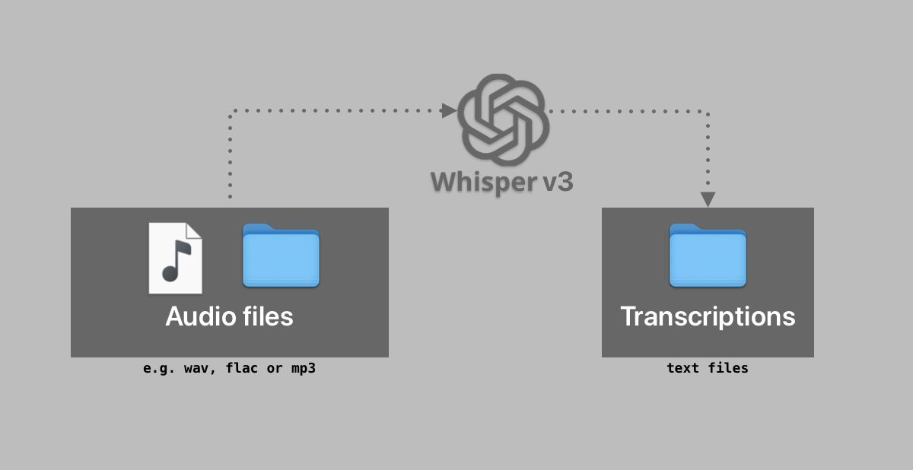

# whisper-3-large-speach-to-text

[]()
[](https://github.com/MaloLM/whisper-3-large-speach-to-text/blob/main/LICENSE)
[](https://www.python.org)

A simple python program for audio files transcription.



<br>

> ⚠️ [Whisper-large-v3](https://huggingface.co/openai/whisper-large-v3) is a 3.09GB model (FP32, relative to hardware). This version is not > designed for real-time TTS although it is possible to adapt it with faster and less efficient transcription models.

### Other Whisper models:

| Size   | Parameters | English-only model | Multilingual model | Required VRAM | Relative speed |
| ------ | ---------- | ------------------ | ------------------ | ------------- | -------------- |
| tiny   | 39 M       | tiny.en            | tiny               | ~1 GB         | ~10x           |
| base   | 74 M       | base.en            | base               | ~1 GB         | ~7x            |
| small  | 244 M      | small.en           | small              | ~2 GB         | ~4x            |
| medium | 769 M      | medium.en          | medium             | ~5 GB         | ~2x            |
| large  | 1550 M     | N/A                | large              | ~10 GB        | 1x             |
| turbo  | 809 M      | N/A                | turbo              | ~6 GB         | ~8x            |

## Software version requirements for the code to work

- [ffmpeg](https://ffmpeg.org) v7.1
- Python `3.10.11` in my case, with following requirements:

```
torch==2.5.1
accelerate==1.1.1
transformers==4.46.2
datasets==3.10
```

## Tested Environments

| Tested | OS     | Version         | Architecture |
| ------ | ------ | --------------- | ------------ |
| ✅     | macOS  | 15.0.1 (24A348) | aarch64      |
| ❌     | Ubuntu | 20.04 LTS       | x86_64       |
| ❌     | WSL    | Ubuntu 20.04    | x86_64       |
